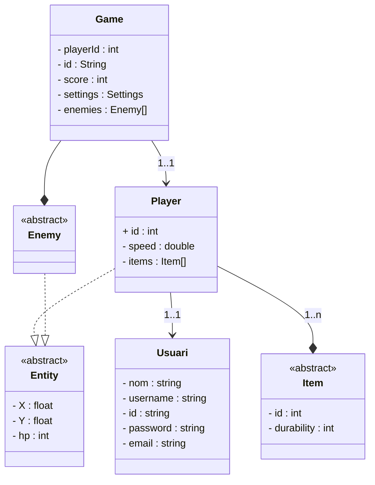

# Backend per el projecte de DSA

## To-Do

[x] Web Registre.

[] Web Login.

[x] Android App Registre.

[] Android App Login.

## Esquema

```mermaid
classDiagram


class Entity{
<<abstract>>
- X : float
- Y : float
- hp : int
}

class Player{
+ id : int
- speed : double
- items : Item[]
}

class Enemy{
<<abstract>>
}

Player ..|> Entity
Enemy ..|> Entity


class Game{
- playerId : int
- id : String
- score : int
- settings : Settings
- enemies : Enemy[]
}


class Item{
<<abstract>>
- id : int
- durability : int
}

class Usuari{
- nom : string
- username : string
- id : string
- password : string
- email : string
}


Player --> Usuari : 1..1
Game --> Player : 1..1
Game --* Enemy
Player --* Item : 1..n
```
