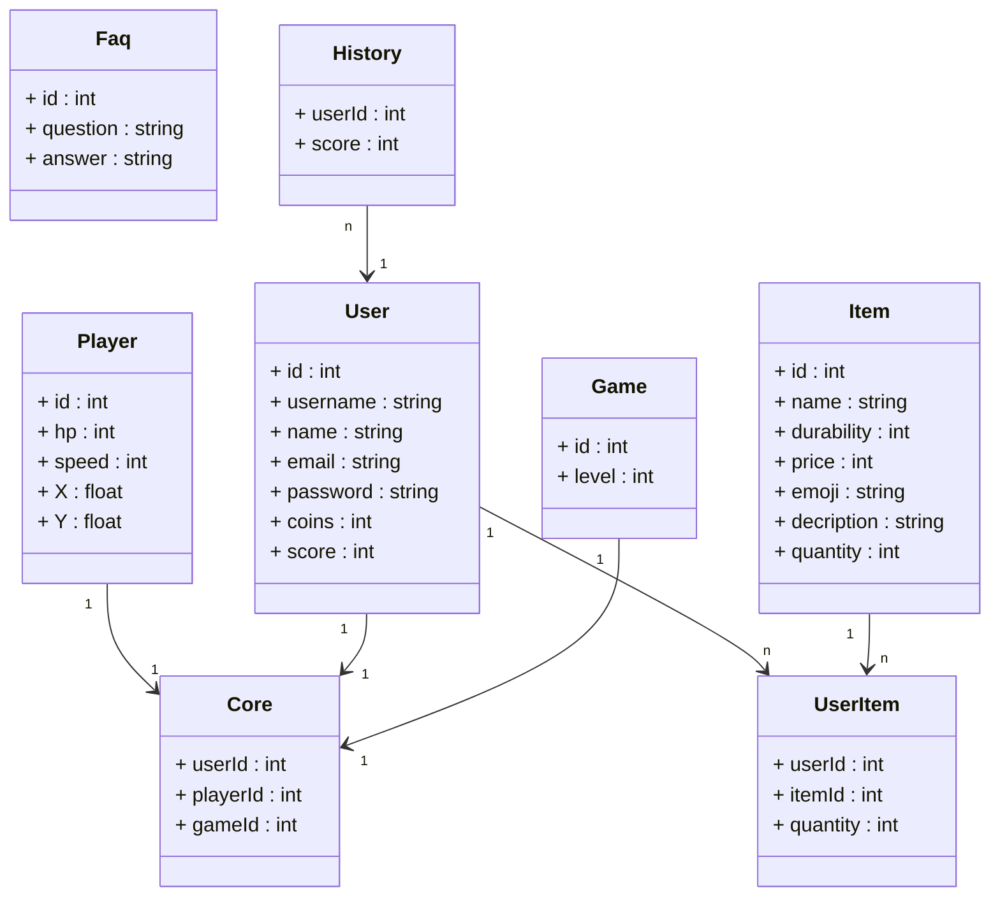

Model de la base de dades:

```mermaid

classDiagram
class Player {
+ id : int
+ hp : int
+ speed : int
+ X : float
+ Y : float
}

class User {
+ id : int
+ username : string
+ name : string
+ email : string
+ password : string
+ coins : int
+ score : int
}

class Game {
+ id : int
+ level : int
}

class Faq {
+ id : int
+ question : string
+ answer : string
}

class History {
+ userId : int
+ score : int
}

class Item {
+ id : int
+ name : string
+ durability : int
+ price : int
+ emoji : string
+ decription : string
+ quantity : int
}


class UserItem {
+ userId : int
+ itemId : int
+ quantity : int
}

class Core {
+ userId : int
+ playerId : int
+ gameId : int
}

Player "1" --> "1" Core
User "1" --> "1" Core
Game "1" --> "1" Core
User "1" --> "n" UserItem
Item "1" --> "n" UserItem

History "n" --> "1" User  
```

